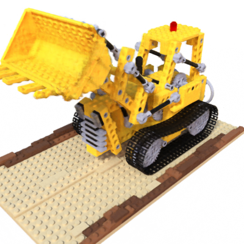
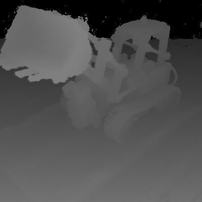
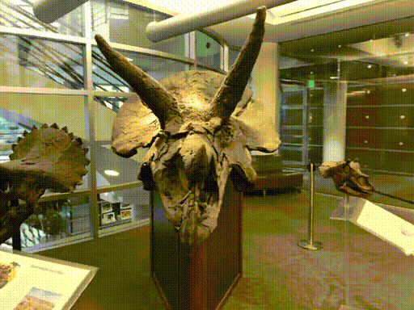

# NeRF-Aris

The goals of this code is to (a) implement volumentric rendering and NeRF training
in Aris, and (b) modify that training code to incorporate depth groundtruth.





## Getting Started

1. Download aris-nerf
2. Set up your environment
3. Download aris data
4. Download nerf data
5. Verify setup

#### 1. Download this repository

```
git clone https://github.com/montehoover/cmsc-740-project
```

#### 2. Environment Setup

You have two options:
  1. Follow the directions listed in the [nerf-pytorch][nerf] and [aris][aris]
     getting started documentation, managing your environment with `conda`.
  2. Use pre-made [docker container][docker] with `singularity pull docker://leesharma/nerf-aris:2.0.0`.

  [nerf]: https://github.com/yenchenlin/nerf-pytorch
  [aris]: https://cmsc740-fall22.github.io/assignment1.md.html
  [docker]: https://hub.docker.com/r/leesharma/nerf-aris

I strongly suggest running these codes on a device with a GPU (and remember to
use `--nv` if you use the container approach.) It's currently set to use a single
GPU---no distributed training.

#### 3. Download Aris data

(See [class instructions][aris] for more details)

1. Download data from [Google Drive](https://drive.google.com/file/d/1E4bdOgKh4r8o94plEn68HpNRod1W9wMd/view?usp=sharing)
2. Put the data in `data/`. Your folder structure should look like this:

    ```
    .vscode/
    aris/
    config/
    data/
      environments/
      meshes/
    render.py
    render_volume.py
    (...other files)
    ```

#### 4. Download NeRF data

1. Download desired datasets [here](https://drive.google.com/drive/folders/128yBriW1IG_3NJ5Rp7APSTZsJqdJdfc1)
   and save them to the `data/` folder. Alternatively, do the same with the data
   in the (much smaller) nerf_example_data.zip file. Your directory structure should look
   something like this after download:

    ```
    .vscode/
    aris/
    config/
    data/
      environments/
      meshes/
      nerf_llff_data/
      nerf_real_360/    # if you downloaded the full set
      nerf_synthetic/
    render.py
    render_volume.py
    (...other files)
    ```

2. Create an `output/nerf/` folder in the project root.
3. Download pretrained models [here](https://drive.google.com/drive/folders/1jIr8dkvefrQmv737fFm2isiT6tqpbTbv).
   Since most trained models will go to the `output/nerf/` folder, we'll put
   these there too. Your directory structures should look something like this:

    ```
    .vscode/
    aris/
    config/
    data/
    outputs/
      nerf/
        fern_test/
        flower_test/
        (...other files)
    render.py
    render_volume.py
    (...other files)
    ```

#### 5. Verify

Verify your basic setup by rendering the lego scene:

```
python render_volume.py nerf=nerf_lego \
  nerf.experiment=lego_test
```

Once that runs, verify the rendered image at `outputs/nerf/lego_test/output_rgb.png`.

To verify training, run

```
python render_volume.py nerf=nerf_lego \
  nerf.train=true
```

Logs will be written to `outputs/nerf/lego` with checkpoints saved every 10k
epochs (on my system, that's every ~20 mins on this dataset.)

See below for more details on rendering and training.


## Rendering

The pre-trained models are stored in directories with `_test` suffixes to
deter overwriting. These are great for testing rendering without training.

For example, to render a view from fern:

```
python render_volume.py nerf=fern \
  nerf.experiment=fern_test
```

The outputs will be written to `outputs/nerf/fern_test/output_{rgb,disp}.py`.

Check out `outputs/nerf/` for a full list of the available pretrained models.

### Rendering a Specified Pose

You can customize your camera position by passing in the `nerf.rendering.pose`
items in the command line. There are three spherical coords: theta, phi, and r.
The viewing angle is towards the center of the volume. All angles are in degrees.

For example:

```
python render_volume.py nerf=nerf_lego \
  nerf.rendering.pose.theta=135 \
  nerf.rendering.pose.phi=-30 \
  nerf.rendering.pose.radius=3
```

### Rendering a Video

To get a better idea of how the volume looks at different angles, you can also
render a full rotation video with a pre-set trajectory (as included in
nerf-pytorch).

Note: these options are incompatible with a custom pose and gui=true.

```
python render_volume.py nerf=nerf_lego \
  nerf.rendering.render_video=true
```

### Interactive Display

TODO (gui=true) --- can't test on my system


## Training

Training is easy---just use set the `nerf.train` property to true!
Logs will be saved at `outputs/nerf/$EXPERIMENT_NAME` every 10k epochs by default.

```
python render_volume.py nerf=chair \
  nerf.experiment=my_awesome_experiment \
  nerf.train=true
```

### Training with depth image data

Download "lego_depths" data from [here](https://drive.google.com/drive/folders/1egZ6y1ECzKpcQRzJz6yDTmQ7qYzb0wtL?usp=share_link) and add it to data/nerf_synthetic. Run training with depth images with the following command:

```
python render_volume.py \
    nerf=nerf_lego_depths \
    nerf.train=true
```

You can add your own depth training by adding an appropriate dataset and setting `nerf.training.use_depths=true`.

(TODO: add more config details)

## Authors

This project was put together by Lee Sharma and Monte Hoover based on existing
work at [nerf-pytorch](https://github.com/yenchenlin/nerf-pytorch) and
[aris](https://github.com/CMSC740-Fall22/aris-renderer-student).
